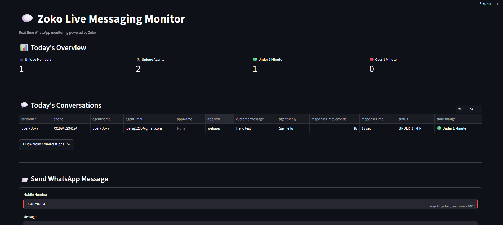

# 💬 Zoko Live Messaging Monitor

A lightweight real-time WhatsApp monitoring dashboard built using
**Node.js (Express)** and **Streamlit**, integrated with the **Zoko
API** and **Supabase**.

The application listens to Zoko webhook events, stores them in Supabase,
calculates today's messaging metrics in real time, and allows users to
send WhatsApp messages directly through the dashboard.

## 🌐 Live Demo

**Streamlit Dashboard**

https://zokotest.streamlit.app

## 📸 Application Preview



## ✨ Features

### 📥 Real-Time Webhook Integration

-   Receives **Incoming WhatsApp Messages** (`message:user:in`)
-   Receives **Outgoing WhatsApp Messages** (`message:store:out`)
-   Stores every webhook event in **Supabase**
-   Processes events in real time

### 📊 Live Dashboard

Displays today's messaging metrics:

-   👥 Unique Members Who Chatted
-   👨‍💼 Unique Human & AI Agents Who Chatted
-   🟢 Conversations receiving a first response within 1 minute
-   🔴 Conversations receiving a first response after 1 minute

The dashboard refreshes automatically every **5 seconds**.

## 💬 Conversation Monitor

Displays today's conversations including:

-   Customer Name
-   Phone Number
-   Agent Name
-   Agent Email
-   AI Agent Name (Guru, WISMO, Hallo, etc.)
-   Customer Message
-   Agent Reply
-   Response Time
-   SLA Status

### 📨 Send WhatsApp Message

-   Mobile number validation
-   Automatic Indian country code (`91`) prefix
-   Delivery status
-   Customer ID
-   Message ID

## 🧠 First Response SLA Logic

For **each customer per day**:

-   Only the first incoming customer message is considered.
-   Only the first agent reply is used for SLA calculation.
-   Any subsequent conversations from the same customer on the same day
    are ignored.
-   Metrics automatically reset each day by calculating only today's
    webhook events.

### Example

``` text
09:00 Customer → Hi
09:00:20 Agent → Hello

✅ Counted

14:00 Customer → Need help
14:04 Agent → Sure

❌ Ignored
```

Dashboard:

``` text
🟢 Under 1 Minute = 1
🔴 Over 1 Minute = 0
```

## 🏗️ Architecture

``` text
WhatsApp Customer
        │
        ▼
     Zoko API
        │
        ▼
Webhook Events
        │
        ▼
Express Backend
        │
 ┌──────┴─────────┐
 │                │
 ▼                ▼
Supabase      Zoko Message API
 │                │
 ▼                ▼
Dashboard     Send Message
        │
        ▼
 Streamlit UI
```

------------------------------------------------------------------------

# 📊 Dashboard Logic

Every dashboard refresh performs the following:

1.  Fetches webhook events from Supabase.
2.  Filters only today's events.
3.  Calculates:
    -   Unique Members
    -   Unique Agents
    -   First Responses Under 1 Minute
    -   First Responses Over 1 Minute
4.  Returns live metrics to the dashboard.

No dashboard values are hardcoded.

------------------------------------------------------------------------


## 🛠️ Tech Stack

-   Node.js
-   Express.js
-   Streamlit
-   Supabase (PostgreSQL)
-   Axios
-   Pandas
-   Zoko Webhook API
-   Zoko Message API


## 📁 Project Structure

``` text
backend/
├── controllers/
├── routes/
├── services/
│   ├── messageService.js
│   ├── statsService.js
│   ├── supabase.js
│   └── zokoService.js
├── app.js
├── server.js
└── package.json

frontend/
├── app.py
└── requirements.txt
```

## ⚙️ Environment Variables

``` env
PORT=5000
ZOKO_API_KEY=YOUR_ZOKO_API_KEY
SUPABASE_URL=YOUR_SUPABASE_PROJECT_URL
SUPABASE_SERVICE_ROLE_KEY=YOUR_SUPABASE_SERVICE_ROLE_KEY
```

## 🚀 Running Locally

### Backend

``` bash
cd backend
npm install
npm run dev
```

Runs on `http://localhost:5000`

### Frontend

``` bash
cd frontend
pip install -r requirements.txt
streamlit run app.py
```

Runs on `http://localhost:8501`

## 🔌 API Endpoints

-   `POST /webhook`
-   `GET /dashboard`
-   `GET /messages`
-   `POST /send-message`

## Webhook Testing

During local development, **ngrok** was used to expose the local backend
to the internet.

``` bash
ngrok http 5000
```

This generated a public HTTPS URL which was configured in the **Zoko
Test Product** webhook settings.

Example:

    https://xxxxx.ngrok-free.app/webhook

Once configured, every incoming and outgoing WhatsApp message was
delivered to the local backend through the webhook.

------------------------------------------------------------------------

## 🌍 Deployment

-   Backend: Railway
-   Frontend: Streamlit Community Cloud

Live App:

https://zokotest.streamlit.app

## 📌 Assumptions

-   Metrics are calculated only from today's webhook events.
-   Each customer contributes only one SLA measurement per day.
-   Both human agents and AI agents are counted.
-   Webhook events are persisted in Supabase.

## 📌 Future Improvements

-   Authentication
-   Historical analytics
-   Date filters
-   Search
-   WebSockets
-   Charts
-   Docker
-   Unit tests
