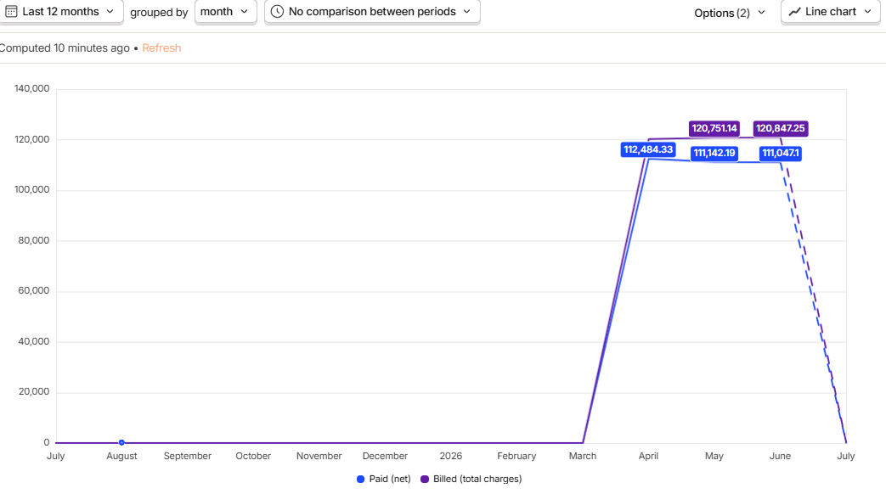
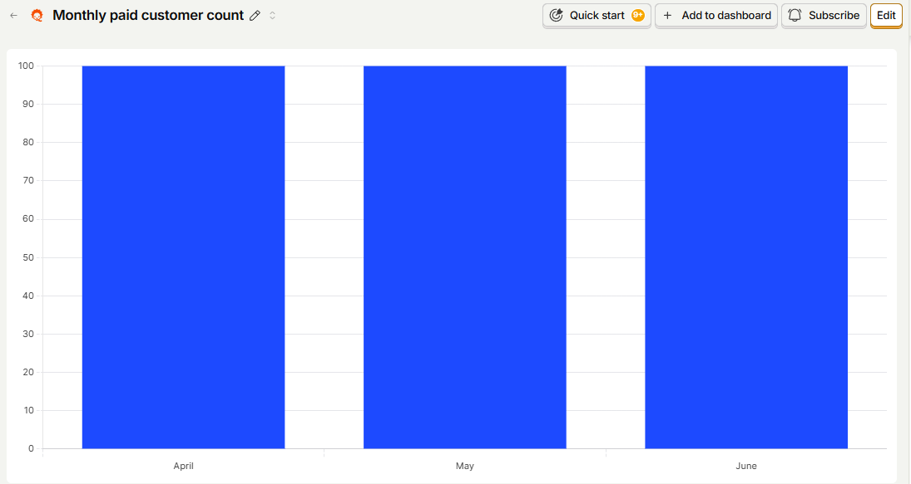
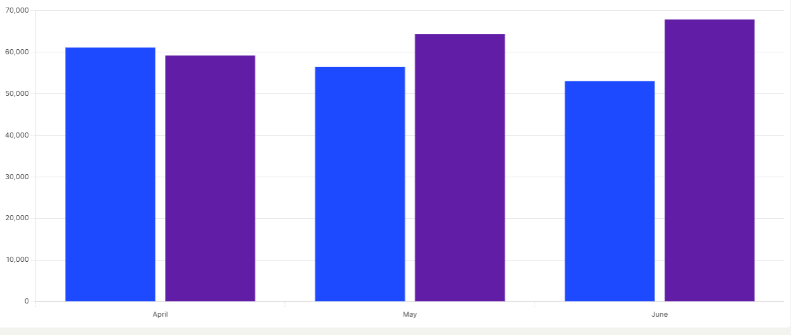
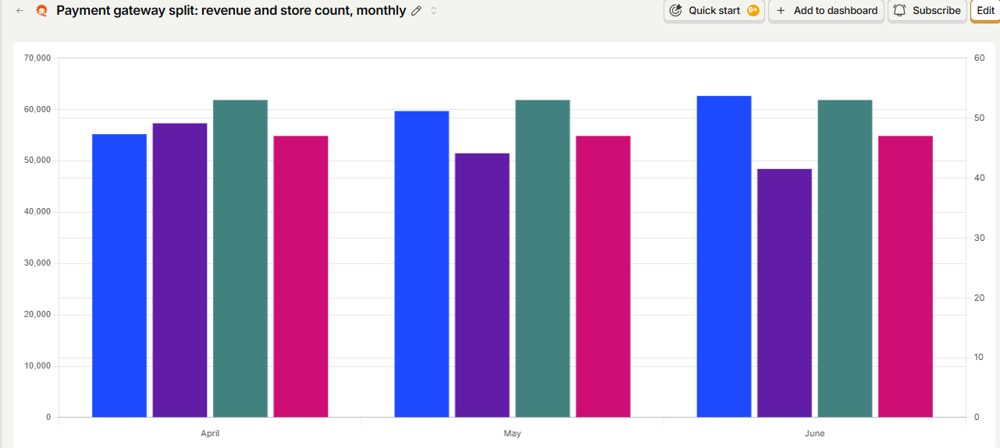
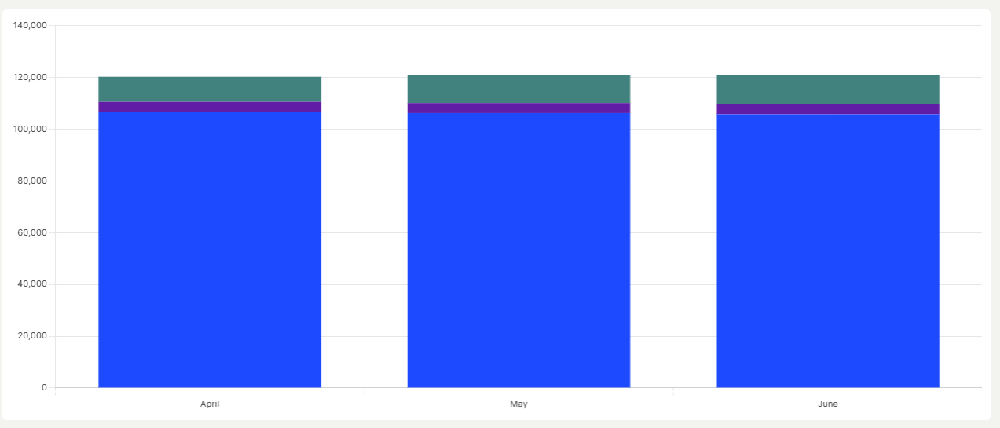

# Zoko – Growth Engineer Take Home
# Task 2 – Revenue Dashboard (PostHog)

**Submitted by:** Joel Siby
**Date:** 07 July 2026

## Overview

Built a revenue analytics dashboard in PostHog using event data from:

- `monthly_billed_amount`
- `monthly_paid_amount`

The dashboard includes SQL-backed insights where required and visualizes monthly revenue trends, customer activity, payment gateway performance, platform segmentation, and feature-wise revenue.

---

## Dashboard Link

**Public Dashboard**

https://us.posthog.com/embedded/D5jM7yMZwJu9azpPZ-W2cJQnKqLcQw

---

# Dashboard

## 1. Monthly Trend: Paid Amount vs Billed Amount

### Screenshot

### Description

Compares monthly billed revenue (gross charges) with the actual net revenue collected.

### Insights

| Month | Billed | Paid | Difference |
|--------|--------:|-----:|-----------:|
| Apr 2026 | $120,236 | $112,484 | ~$7,752 |
| May 2026 | $120,751 | $111,142 | ~$9,609 |
| Jun 2026 | $120,847 | $111,047 | ~$9,800 |

**Observations**

- Revenue remained stable across all three months.
- The gap between billed and paid widened slightly.
- The difference may represent payment processing fees or other deductions.

---

## 2. Monthly Paid Customer Count

### Screenshot

### Description

Displays the number of unique stores that successfully made a payment each month.

### Results

| Month | Paid Customers |
|--------|---------------:|
| Apr 2026 | 100 |
| May 2026 | 100 |
| Jun 2026 | 100 |

**Observations**

- 100 paying stores every month.
- Stable customer base during the observed period.

---

## 3. Shopify vs Non-Shopify Revenue Split (SQL)

### Screenshot

### Description

SQL insight comparing billed revenue generated by Shopify and non-Shopify stores.

### Results

| Month | Shopify | Non-Shopify | Shopify Share |
|--------|---------:|------------:|--------------:|
| Apr |    $59,167 | $61,070 |       49.2% |
| May |    $64,307 | $56,444 |       53.2% |
| Jun |    $67,839 | $53,008 |       56.1% |

**Observations**

- Shopify's revenue contribution increased every month.
- Non-Shopify revenue declined over the same period.
- Shopify became the dominant revenue source by June.

---

## 4. Payment Gateway Split (Monthly Revenue & Store Count)

### Screenshot

### Description

Monthly comparison of revenue and merchant count grouped by payment gateway.

### Results

| Month | Gateway | Net Revenue | Stores |
|--------|---------|------------:|-------:|
| Apr | Shopify | $55,188 |         53 |
| Apr | Stripe  | $57,297 |         47 |
| May | Shopify | $59,682 |         53 |
| May | Stripe  | $51,460 |         47 |
| Jun | Shopify | $62,629 |         53 |
| Jun | Stripe  | $48,418 |         47 |

**Observations**

- Shopify revenue grew consistently.
- Stripe revenue declined across the three months.
- Merchant distribution remained unchanged.

---

## 5. Feature-wise Revenue (SQL)

### Screenshot

### Description

SQL insight showing monthly billed revenue grouped by revenue component.

### Results

# 📊 Monthly Revenue Results

| Month | Subscription | Markup  | Flowhippo  |   Total  |
|-------|-------------:|--------:|-----------:|--------- |
| Apr   | $106,722     | $3,801  | $9,713     | $120,236 |
| May   | $106,197     | $3,877  | $10,677    | $120,751 |
| Jun   | $105,736     | $3,822  | $11,290    | $120,847 |

**Observations**

- Subscription revenue declined slightly.
- Flowhippo revenue increased steadily.
- Markup revenue remained relatively constant.
- Overall billed revenue stayed stable because Flowhippo growth offset the subscription decline.

---

# Deliverables Checklist

- ✅ Monthly trend graph: Paid Amount vs Billed Amount
- ✅ Monthly paid customer count
- ✅ Shopify vs Non-Shopify split (SQL)
- ✅ Payment gateway split (Revenue & Customer Count)
- ✅ Feature-wise revenue (SQL)
- ✅ Public dashboard link